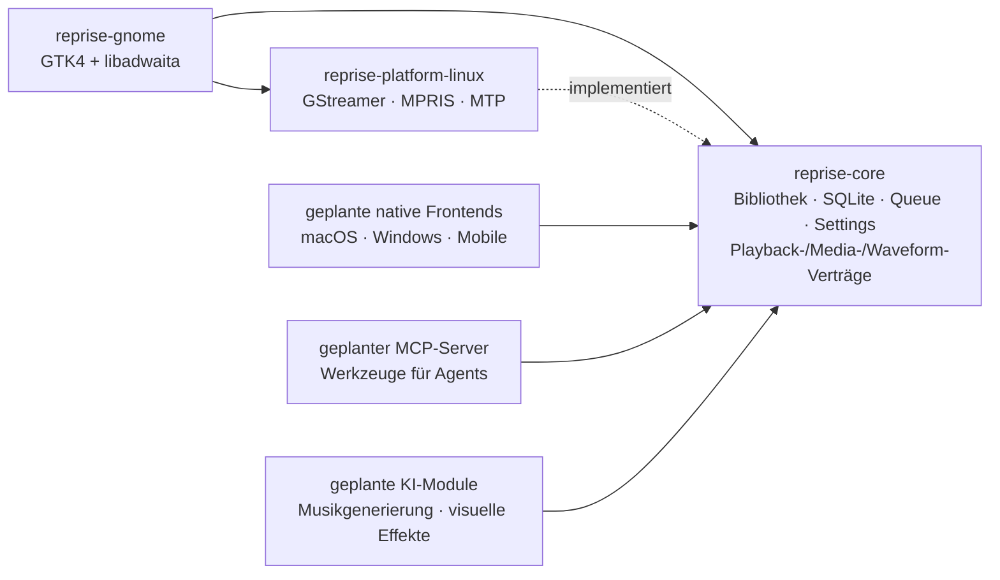

# Reprise

[English](README.md) · [Deutsch](README.de.md)

Reprise ist ein nativer GTK4-/libadwaita-Musikplayer für GNOME auf Basis einer
portablen Rust-Engine ohne GUI-Abhängigkeiten. Das Projekt verbindet einen
ernsthaften Player für lokale Musiksammlungen mit einer Architekturfrage: Wie
weit trägt ein getesteter Rust-Core, wenn jede Plattform nur eine schlanke,
wirklich native UI- und Integrationsschicht ergänzt?

**Gestartet am 11. Juli 2026 · aktives Portfolio-Projekt · Version 0.1.0 ist
noch kein öffentliches Release.**

## Was dieses Repository zeigt

- Ein echtes Desktop-Produkt: Bibliotheksverwaltung, Wiedergabe, Playlists,
  Tag-Editor, Lyrics, Scrobbling, MPRIS, Android-/MTP-Sync,
  Session-Wiederherstellung und eine native GNOME-Oberfläche.
- Eine tiefe Modulgrenze: SQLite-Abfragen, Scanner, Queue-Semantik,
  Einstellungen und Plattformverträge leben in `reprise-core`; GTK,
  GStreamer und D-Bus nicht.
- Evidenzbasierte Performance-Arbeit: generierte Profile mit 10.000 und
  100.000 Tracks, stabiles JSON, deterministische Speicher-/Cache-Budgets und
  Vorher-/Nachher-Vergleiche der Query-Pläne.
- Produktregeln als Code: UX-, Accessibility-, Feedback-, Tastatur- und
  Motion-Verträge sind mit regelbenannten Tests und Merge-Gates verbunden.
- Sichere Systemarbeit: keine Telemetrie, isolierte Testprofile, explizite
  Netzwerkmodule, abgesicherte destruktive Aktionen und kein automatisierter
  Zugriff auf eine reale Musiksammlung.

## Architektur: ein Rust-Core, native Ränder



Der Core hat keine Abhängigkeit zu GTK, libadwaita, GStreamer, zbus oder GLib.
Ein Gate beweist diese Eigenschaft mit `cargo tree`; Frontend-Linter verbieten
zusätzlich direkte GStreamer-Kopplung, blockierendes HTTP, produktives SQL und
neuen Unsafe-Code am Präsentationsrand. Linux liefert aktuell
GStreamer-Wiedergabe, MPRIS/D-Bus, Waveform-Extraktion, Papierkorb und
Gerätesynchronisierung hinter den Verträgen des Cores.

Das Ziel ist keine plattformübergreifende UI auf dem kleinsten gemeinsamen
Nenner. Die gemeinsame Rust-Engine besitzt Verhalten und Daten; jede Plattform
bekommt eine schlanke UI-Schicht und native Integrationen.

## Performance: messen statt vermuten

Die aktuellen Optimierungen beginnen mit reproduzierbarer Evidenz. Die
Benchmarks erzeugen reine Metadaten-Datenbanken in privaten temporären
Verzeichnissen, nutzen Release-Builds, behalten Manifeste und JSON-Artefakte
und verweigern das Überschreiben eines bestehenden Ausgabeordners oder
Benutzerprofils.

Die erste benchmarkgetriebene Datenbankänderung ergänzt einen partiellen
`NOCASE`-Index für sichtbare Tracks. Unter denselben Host- und
Build-Bedingungen ergab der akzeptierte Vergleich mit 100.000 Tracks:

| Messung | Vorher | Nachher | Effekt |
|---|---:|---:|---:|
| Letztes Titel-Fenster mit 200 Zeilen | 53.605 µs | 1.333 µs | **-97,51 %** |
| Projektion der Playback-IDs | 8.125 µs | 298 µs | **-96,33 %** |
| SQLite-Plan | Full Scan + temporäre Sortierung | partieller Index-Scan | keine temporäre Sortierung |
| Datenbankspeicher | Ausgangswert | +2.379.776 Bytes | **+9,85 %** Trade-off |

Das Tracklistenmodell ist unabhängig davon bei 10.000 und 100.000 Tracks auf
**8 gecachte SQL-Fenster / 1,600 gehaltene Zeilen** begrenzt. Fünf frische
Prozesse maßen für die Queue mit 100.000 Tracks ein RSS-Delta von 1.609.728
Bytes beziehungsweise **16,10 Byte/Track**. Laufzeiten sind Evidenz für den
Vergleich auf demselben Host, keine portablen CI-Grenzwerte; die
deterministischen Cache- und Speicherbudgets sind die harten Assertions.

```sh
scripts/performance-baseline.sh /tmp/reprise-before
# Implementierung ändern und danach vom Kandidaten-Commit erneut ausführen
scripts/performance-baseline.sh /tmp/reprise-after
scripts/performance-query-compare.sh \
  /tmp/reprise-before /tmp/reprise-after > /tmp/query-comparison.json
```

Die Installed-Runtime-Suite misst zusätzlich Startzeit, realisierte GTK-Zeilen
und -Zellen, Provider-/Modellzahlen, Queue-Speicher und eine per CUA beobachtete
Scroll-Reaktion. Ist keine private D-Bus-/Xvfb-/AT-SPI-Session möglich, bricht
sie geschlossen ab und fällt nie auf den echten Desktop zurück. Details stehen
in der [Test- und Benchmark-Strategie](TESTING.md).

## Qualität als ausführbare Policy

Das letzte vollständige Branch-Gate dokumentiert **1.482 bestandene Tests**:
758 im Core, 669 im GNOME-Frontend und 55 auf der Linux-Plattform. Weitere 139
Tests sind bewusst getrennt, weil sie kontrollierte Display- oder
Host-Bedingungen benötigen.

Der reproduzierbare Analyzer aus dem Bewerbungs-/CV-Repository zählt nur
committeten Rust-Code; Leerzeilen und reine Kommentarzeilen bleiben außen vor.
Beim Abschluss der Performance-Arbeit maß er **88.789 Rust-Codezeilen**: 58.053
Produktcode- und 30.736 Testzeilen. Die CV-Darstellung rundet denselben Snapshot
auf **58.100 Produkt + 30.700 Tests = 88.800 gesamt**; Tests werden nicht als
Produktcode ausgegeben.

Jeder Merge-Kandidat durchläuft:

```sh
cargo fmt --check
cargo clippy --locked --all-targets --workspace -- -D warnings
env RUSTDOCFLAGS="-D warnings" cargo doc --locked --workspace --no-deps
cargo test --locked --workspace
cargo audit
scripts/check-architecture.sh
scripts/check-ux-traceability.sh
```

Das Architektur-Gate beweist die Abhängigkeitsreinheit des Cores, hält jede
Rust-Datei unter 800 Zeilen, begrenzt UI-Kompositionswurzeln und verhindert
bekannte Frontend-Kopplungen. Das Dependency-Audit stoppt bei jeder neuen
Advisory; aktuell ist genau eine dokumentierte transitive Maintenance-Warnung
für `paste` akzeptiert.

Reprise besitzt außerdem **60 aktive UX-Regeln** im verbindlichen
[UX-Regelwerk](docs/ux-rules.md). Eine Regel darf nur aktiv sein, wenn ein
passender regelbenannter Test existiert. Der Vertrag umfasst
Wiedergabesemantik, Tastatur- und Fokusverhalten, Feedback, Tooltips,
Accessibility-relevante Erreichbarkeit und alle sieben Motion-Regeln.
Reduced-Motion-Einstellungen gewinnen gegen jede dekorative Animation.
Pointer-Tests, isolierte GTK-Tests, CUA-/AT-SPI-Flows und eine manuelle
GNOME-Checkliste trennen automatisierte Evidenz ehrlich von visueller oder
hardwareabhängiger Verifikation.

## Heutiger Produktumfang

- Fensterbasierte Spaltenansicht für große lokale Bibliotheken; Suche,
  Genre-/Artist-/Album-Filter, Bewertungen, Play Counts, persistente Spalten
  sowie Ansichten für fehlende Dateien und Importfehler.
- Inkrementeller Scan, Live-Watcher, Move-Erkennung und identitätsgesicherte
  Abstimmung, die Playlists und Historie erhält.
- GStreamer-Wiedergabe mit Queue, Shuffle, Repeat, Gapless/Crossfade,
  Zehnband-Equalizer und Track-/Album-ReplayGain.
- MPRIS-Medientasten, Quick Settings, Benachrichtigungen,
  Sperrbildschirm-Metadaten und Cover.
- Manuelle und intelligente Playlists, M3U-/M3U8-Import und -Export, Drag &
  Drop und Queue-Sortierung.
- Android-/MTP-Browsing und -Synchronisierung mit Abbruch, Fortschritt,
  Transcoding und gerätespezifischer Planung.
- Eingebettete, lokale und gecachte Online-Cover; synchronisierte Lyrics;
  optionale ListenBrainz-, Last.fm- und Artist-News-Integrationen.
- Multi-Track-Tag-Editor, der nur explizit veränderte Felder schreibt, plus
  Datenbankentfernung und bestätigte Papierkorb-Flows.
- Ersteinrichtung, Session-Restore ohne Autoplay, Rhythmbox-Import und kompakte
  native Player-Layouts.

Reprise scannt `mp3`, `flac`, `ogg`, `opus`, `m4a`, `aac` und `wav`; die
tatsächliche Dekodierung hängt von den installierten GStreamer-Codecs ab.

## Roadmap: derselbe Core über den heutigen Player hinaus

Das sind Architekturziele, keine bereits ausgelieferten Features.

| Richtung | Geplante Naht | Produktgrenze |
|---|---|---|
| **MCP-Server** | Schmaler Adapter über Core-Queries, Playlists, Queue und Playback-Verträge | Explizite Capabilities; standardmäßig read-only; keine Pfad- oder Credential-Leaks |
| **KI-generierte Musik** | Providerneutrales, optionales Modul; Ergebnisse laufen durch den normalen Importpfad | Klare Herkunft und explizite Benutzeraktion; niemals stille Bibliotheksmutation |
| **Visuelle KI-Effekte** | Plattformvertrag für Analyse plus nativer Renderer je Frontend | Begrenzte Arbeit, kein Blockieren des Audio-Threads, High-Contrast-Fallback und Reduced Motion/Off gewinnt immer |
| **Schlanke native Frontends** | SwiftUI, WinUI, Mobile oder ein anderes Linux-Toolkit nutzen den MIT-Rust-Core und liefern Plattformverträge | Native Interaktionsmuster statt einer gemeinsamen Web-Shell |

Damit bleiben experimentelle KI- und Agent-Fähigkeiten außerhalb des
Core-Domänenmodells, bis ihre Verträge bewiesen sind. Das vorhandene
Modulregister, die Playback-/Media-/Waveform-Traits und das Purity-Gate liefern
die Nähte; sie behaupten nicht, dass die Roadmap bereits umgesetzt ist.

## Datenschutz und Dateisicherheit

Bibliotheksdatenbank und Einstellungen bleiben lokal; Reprise enthält keine
Telemetrie. Musikdateien werden nur durch einen expliziten Tag-Edit geschrieben.
Das Entfernen eines Tracks löscht keine Datei, und der Papierkorb verlangt eine
Bestätigung. Optionale Online-Funktionen legen ihren Datenfluss offen, speichern
Credentials im System-Keyring und nutzen bei Bedarf getrennte dauerhafte
Queues. Android-Sync schreibt ausschließlich unter `Music/Reprise` und löscht
keine fremden Gerätedateien.

## Build

### Voraussetzungen

- Rust stable (Edition 2021), Meson 1.3+ und Ninja
- GTK 4.22+, libadwaita 1.9+, GStreamer 1.x mit Codec-Plugins
- GVfs mit MTP-Volume-Monitor für Android-Synchronisierung
- SQLite, gettext und die üblichen GNOME-Build-Werkzeuge

### Aus dem Quelltext

```sh
cargo build --workspace
cargo run
cargo test --workspace
```

### Installation mit Meson

```sh
meson setup _build --prefix="$HOME/.local" -Dprofile=release
meson compile -C _build
meson install -C _build
```

Das Flatpak-Manifest zielt auf GNOME 50 und baut Cargo-Abhängigkeiten offline
aus gepinnten Checksums. Siehe [flatpak/README.md](flatpak/README.md) und die
[Release-Checkliste](RELEASING.md).

## Lizenz

Die portable Engine (`reprise-core`, `reprise-platform-linux`) steht unter
**MIT**. Das native GTK4-Linux-Frontend (`reprise-gnome`) steht unter
**GPL-3.0-or-later**. [LICENSING.md](LICENSING.md) erklärt die Gründe und
Komponentengrenzen.
