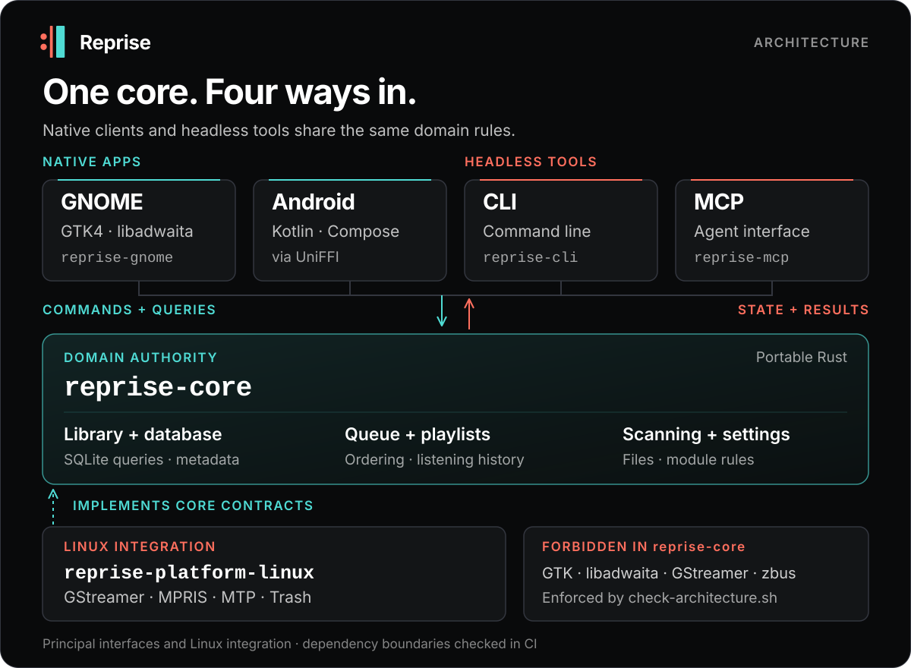

# Reprise

[English](README.md) · [Deutsch](README.de.md)

Reprise is for people who still own their music — and for developers who want
native desktop UX, portable domain design, and measurable systems work in one
Rust codebase. It pairs a GTK4/libadwaita GNOME app with a GUI-free core and
explicit Linux platform contracts.

> **Status:** active alpha. Reprise is not a public release yet.

## Why Reprise

- **Local-first depth.** Large-library scanning, metadata, search, playlists,
  listening history, Android sync, and file safety work without turning the
  library into a cloud account.
- **Native by design.** GTK4/libadwaita owns the GNOME experience; GStreamer,
  MPRIS, MTP, keyring, and Trash integration stay at the Linux edge.
- **Built to be inspected.** Architecture, UX, accessibility, performance, and
  delivery rules are executable contracts rather than README promises.

## Architecture



| Crate | Owns | Must not own |
|---|---|---|
| `reprise-core` | Library, SQLite queries, queue semantics, scanning, playlists, settings, and platform contracts | GTK, libadwaita, GStreamer, zbus, or GLib dependencies |
| `reprise-platform-linux` | GStreamer playback and analysis, MPRIS/D-Bus, MTP, Trash, and other Linux adapters | Product UI or duplicated domain rules |
| `reprise-gnome` | GTK4/libadwaita presentation, interaction state, accessibility, and desktop composition | Productive SQL, blocking HTTP, or direct GStreamer orchestration |
| `reprise-cli` | Headless CLI over core facades: playlists, search, library summary, scan, and instrumental jobs | Any workspace crate beyond reprise-core (bar the feature-gated mpris/worker exceptions) or productive SQL |
| `reprise-mcp` | Local stdio MCP server exposing read-only library resources and capability-gated create tools to agents | Any workspace crate beyond reprise-core, productive SQL, or playback/queue/tag/delete tools |
| `reprise-stems` | Portable stem-separation backend (ML inference) for the experimental instrumental jobs | Any workspace crate beyond reprise-core, or GUI/engine coupling |

The shared engine owns behavior and data; platform crates implement narrow
contracts, while each frontend remains native. The `reprise-cli` and
`reprise-mcp` frontends run as separate processes over the same database, and a
change-log notifier surfaces their edits in a running GTK app live, without a
restart. `scripts/check-architecture.sh` enforces the dependency direction, core
purity, source-size limits, and known presentation-layer coupling hazards.

## Engineering contracts

- **Behavior is specified.** The binding [UX rulebook](docs/ux-rules.md) maps
  every active rule to a rule-named Rust or CUA test, including keyboard,
  focus, accessibility, feedback, and reduced-motion behavior.
- **Large libraries stay bounded.** The track model combines GTK widget
  virtualization with lazy 200-row SQLite windows and a fixed cache budget.
  Accepted comparisons use generated 10,000- and 100,000-track profiles.
- **Async UI work is identity-safe.** Recycled rows and long-running workers
  use generation tokens so stale covers, metadata, lyrics, and progress cannot
  repaint a different visible item.
- **Risky edges are explicit.** Network modules are opt-in, credentials use the
  system keyring, file mutation requires a user action, and automated checks
  use isolated profiles rather than a real music library.

Benchmark methods, limitations, and accepted evidence live in
[TESTING.md](TESTING.md) and the [engineering showcase](docs/showcase.md), not
as fast-drifting totals in this developer entry point.

## Contributing

**Choose your seam:** work on pure library, scanner, queue, or playlist logic
in `reprise-core`; native interaction and accessibility in `reprise-gnome`; or
audio, desktop, and device adapters in `reprise-platform-linux`.

Start with [AGENTS.md](AGENTS.md) and the [UX rulebook](docs/ux-rules.md).
Changes begin with a failing test, keep the core boundary intact, and move by
pull request through `feature → dev → main`. The aim is not more code; it is a
better music player with evidence that the change is correct.

## Build and run

Requirements: Rust 1.92+, Meson 1.3+, Ninja, GTK 4.22+, libadwaita 1.9+,
SQLite, gettext, GStreamer 1.x, and GVfs with its MTP volume monitor.

Install the GStreamer codec plugins needed by the files you want to play.

```sh
cargo build --locked --workspace
cargo run --locked -p reprise-gnome
cargo test --locked --workspace
```

Install through Meson:

```sh
meson setup _build --prefix="$HOME/.local" -Dprofile=release
meson compile -C _build
meson install -C _build
```

Meson builds compile the experimental stem-separation backend by default
(`-Dstem_backend=true`); pass `-Dstem_backend=false` for a core-only binary,
while the plain `cargo build` above always stays core-only.

`reprise-mcp` (the agent-facing MCP server) is not part of the Meson desktop
build above; it is built directly with Cargo, ad hoc. Its playback-control
tools (`music_playback_control`, `music_play`) live behind the opt-in `mpris`
feature, the same pattern as the CLI's `mpris`/`worker` exceptions:

```sh
cargo build --locked -p reprise-mcp --release --features mpris
```

The default `cargo build -p reprise-mcp` (no extra features) stays
D-Bus-free and simply omits the playback tools.

The Flatpak manifest targets GNOME 50 and resolves Cargo dependencies from
pinned checksums. See [flatpak/README.md](flatpak/README.md).

## Verification

The focused local baseline is:

```sh
cargo fmt --check
cargo clippy --locked --all-targets --workspace -- -D warnings
cargo test --locked --workspace
scripts/check-architecture.sh
scripts/check-ux-traceability.sh
```

A clean merge candidate runs the complete pull-request gate, including
warning-free Rustdoc, dependency audit, isolated GTK display suites, and the
accessibility and input contracts:

```sh
MERGE_READINESS_BASE_REF=origin/dev scripts/check-merge-readiness.sh --no-fetch
```

Release candidates additionally validate desktop metadata, Flatpak sources,
translations, and an optimized Meson install through `scripts/check-release.sh`.

Display tests fail closed when private D-Bus/Xvfb/AT-SPI services are
unavailable; they never fall back to the live desktop or user profile.

## Documentation

| Document | Purpose |
|---|---|
| [AGENTS.md](AGENTS.md) | Repository workflow, safety boundaries, and required gates |
| [TESTING.md](TESTING.md) | Test layers, benchmark method, and evidence limits |
| [docs/ux-rules.md](docs/ux-rules.md) | Binding interaction and accessibility contracts |
| [docs/agents/branching.md](docs/agents/branching.md) | `feature → dev → main` pull-request flow |
| [docs/showcase.md](docs/showcase.md) | Portfolio positioning and deeper engineering evidence |
| [RELEASING.md](RELEASING.md) | Packaging and release checklist |

## License

The portable engine (`reprise-core`, `reprise-platform-linux`) is **MIT**. The
native GTK4 frontend (`reprise-gnome`) is **GPL-3.0-or-later**. See
[LICENSING.md](LICENSING.md) for the rationale and component boundaries.
