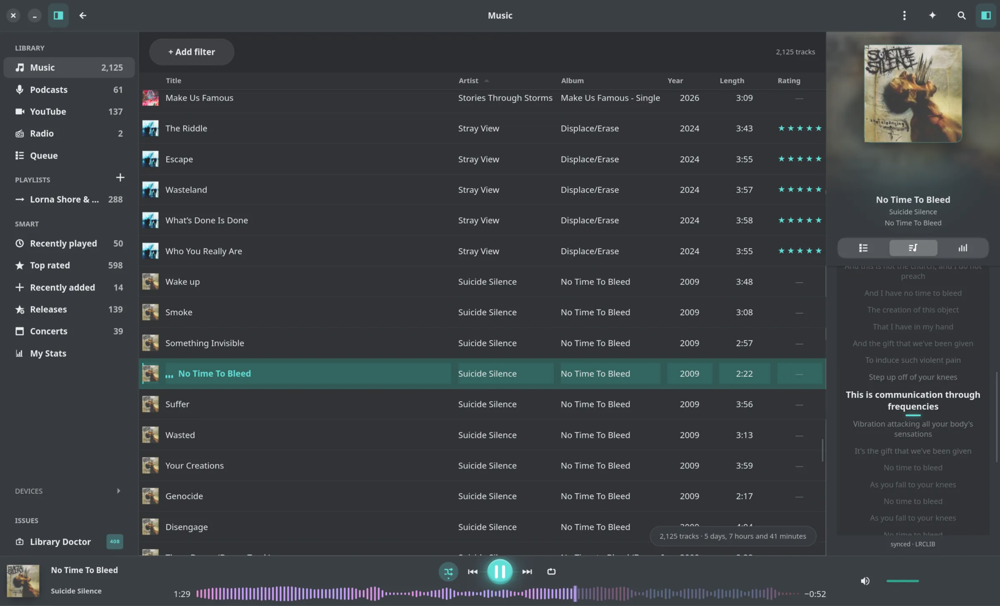
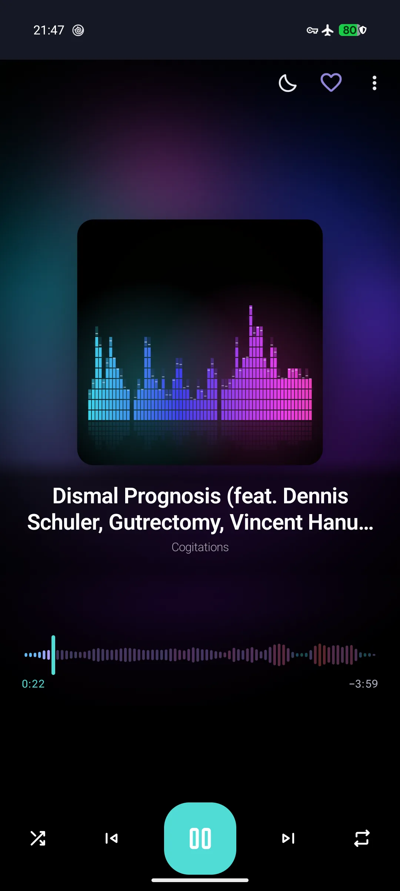

# Reprise

Build a music player people enjoy using — without treating their library as a
cloud account. Reprise is a native GNOME player written in Rust, with a shared
engine that also powers an Android client. It is a welcoming place to work on
real desktop, mobile, audio, and library-management problems.

<p align="center">
  
  
</p>

Reprise keeps scanning, metadata, search, playlists, listening history,
podcasts, radio, and device sync local. GTK4/libadwaita gives the desktop client
its GNOME feel; the portable Rust core keeps the product rules shared rather
than duplicated across platforms.

## Downloads

Each [latest release](https://github.com/marvinbaudach/reprise/releases/latest)
contains the GNOME Flatpak bundle, and the
[same release](https://github.com/marvinbaudach/reprise/releases/latest)
contains the universal Android APK.

```sh
flatpak install --user flathub org.gnome.Platform//50
flatpak install --user ./Reprise-<desktop-version>.flatpak
adb install -r ./Reprise-Android-<android-version>.apk
```

The desktop and Android version numbers are independent and are stated on the
release page.

## Why Reprise

- **Local first:** library data and playback stay on the device.
- **Native clients:** GTK4/libadwaita on GNOME; a shared Rust engine on Android.
- **Evidence-led:** architecture, UX, accessibility, and performance have gates.

## Architecture


- `reprise-core` owns library rules, queries, scanning, playlists, settings, and
  platform contracts — never GTK, GStreamer, or D-Bus.
- `reprise-platform-linux` implements GStreamer, MPRIS, MTP, and Trash.
- `reprise-gnome` owns native GTK4/libadwaita presentation and interaction.

The CLI, MCP server, runtime, view model, and Android FFI stay behind those
boundaries. `scripts/check-architecture.sh` enforces them.

## Engineering contracts

Every active [UX rule](docs/ux-rules.md) has a rule-named test. Async rows use
generation tokens; network features are opt-in; checks use isolated profiles.
Methods and evidence live in [TESTING.md](TESTING.md) and the
[engineering showcase](docs/showcase.md).

## Contributing

**Pick your entry point:** domain work in `reprise-core`; GTK interaction in
`reprise-gnome`; desktop and device adapters in `reprise-platform-linux`.
Read [CONTRIBUTING.md](CONTRIBUTING.md), then follow [AGENTS.md](AGENTS.md).
Changes start with a failing test and land through a squashed PR into `dev`.

## Build and run

Requires Rust 1.92+, Meson, Ninja, GTK 4.22+, libadwaita 1.9+, SQLite, gettext,
GStreamer Good Plug-ins, and GVfs MTP support.

```sh
cargo build --locked --workspace
cargo run --locked -p reprise-gnome
cargo test --locked --workspace
```

```sh
meson setup _build --prefix="$HOME/.local" -Dprofile=release
meson compile -C _build
meson install -C _build
```

See [flatpak/README.md](flatpak/README.md) for Flatpak and `reprise-mcp` builds.

## Verification

```sh
cargo fmt --check
cargo clippy --locked --all-targets --workspace -- -D warnings
cargo test --locked --workspace
scripts/check-architecture.sh
scripts/check-ux-traceability.sh
```

```sh
MERGE_READINESS_BASE_REF=origin/dev scripts/check-merge-readiness.sh --no-fetch
```

The merge gate also covers Rustdoc, audit, isolated GTK display, accessibility,
and input checks. Release candidates run `scripts/check-release.sh`.

## Documentation

- [CONTRIBUTING.md](CONTRIBUTING.md) — onboarding and pull requests
- [AGENTS.md](AGENTS.md) — workflow and safety boundaries
- [TESTING.md](TESTING.md) — test layers and evidence limits
- [docs/ux-rules.md](docs/ux-rules.md) — interaction contract
- [docs/showcase.md](docs/showcase.md) — deeper engineering evidence
- [RELEASING.md](RELEASING.md) — release checklist

## License

Reprise is **GPL-3.0-or-later**. See [LICENSE](LICENSE) and [LICENSING.md](LICENSING.md).

## How this project is built

Reprise uses AI assistance under human-owned architecture and review. The
maintainer owns product decisions and the commit history preserves co-authorship.
