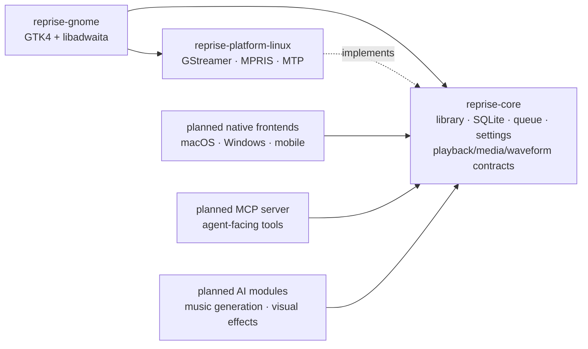

# Reprise

[English](README.md) · [Deutsch](README.de.md)

Reprise is a native GTK4/libadwaita music player for GNOME built around a
portable, GUI-free Rust engine. It combines a serious local-library player
with an engineering question: how far can one tested Rust core go when each
platform keeps a small, genuinely native UI and platform adapter?

**Started on 11 July 2026 · active portfolio project · version 0.1.0 is not a
public release yet.**

## What this repository demonstrates

- A real desktop product: library management, playback, playlists, tag
  editing, lyrics, scrobbling, MPRIS, Android/MTP sync, session restore, and a
  native GNOME interface.
- A deep module boundary: SQLite queries, scanning, queue semantics, settings,
  and platform contracts live in `reprise-core`; GTK, GStreamer, and D-Bus do
  not.
- Evidence-driven performance work: generated 10,000- and 100,000-track
  profiles, stable JSON results, deterministic memory/cache budgets, and
  before/after query-plan comparisons.
- Product rules as code: UX, accessibility, feedback, keyboard, and motion
  contracts are linked to rule-named tests and merge gates.
- Safe systems work: no telemetry, isolated test profiles, explicit network
  modules, guarded destructive actions, and no automated access to a real
  music library.

## Architecture: one Rust core, native edges



The core has no GTK, libadwaita, GStreamer, zbus, or GLib dependency. A gate
checks that property with `cargo tree`; frontend linters also reject direct
GStreamer coupling, blocking HTTP, productive SQL, and new unsafe code at the
presentation edge. Linux currently supplies GStreamer playback, MPRIS/D-Bus,
waveform extraction, Trash, and device synchronization behind the core's
contracts.

The goal is not one lowest-common-denominator cross-platform UI. The shared
Rust engine owns behavior and data; each platform should own a slim UI layer
and native integrations.

## Performance: measured, not assumed

The current optimization work starts with reproducible evidence. Benchmarks
generate metadata-only databases in private temporary directories, run release
builds, retain manifests and JSON artifacts, and refuse to overwrite an
existing output directory or user profile.

The first benchmark-driven database change added a partial `NOCASE` index for
visible tracks. On the same host and build conditions, the accepted 100,000-
track comparison measured:

| Measurement | Before | After | Effect |
|---|---:|---:|---:|
| Final 200-row title window | 53,605 µs | 1,333 µs | **-97.51%** |
| Playback-ID projection | 8,125 µs | 298 µs | **-96.33%** |
| SQLite plan | full scan + temporary sort | partial index scan | no temporary sort |
| Database storage | baseline | +2,379,776 bytes | **+9.85%** trade-off |

The track-list model is independently constrained to **8 cached SQL windows
and 1,600 retained rows** at both 10,000 and 100,000 tracks. Five fresh processes
measured the 100,000-track queue RSS delta at 1,609,728 bytes, or **16.10 bytes/track**.
Timings are same-host comparison evidence, not portable CI
thresholds; deterministic cache and memory bounds are the hard assertions.

```sh
scripts/performance-baseline.sh /tmp/reprise-before
# change the implementation, then run again from the candidate commit
scripts/performance-baseline.sh /tmp/reprise-after
scripts/performance-query-compare.sh \
  /tmp/reprise-before /tmp/reprise-after > /tmp/query-comparison.json
```

The installed-runtime suite additionally measures startup, realized GTK rows
and cells, provider/model counts, queue memory, and CUA-observed scroll
response. It fails closed when a private D-Bus/Xvfb/AT-SPI session is not
available and never falls back to the live desktop. See the full
[testing and benchmarking strategy](TESTING.md).

## Quality is executable policy

The latest complete branch gate recorded **1,482 passing tests**: 758 core,
669 GNOME, and 55 Linux-platform tests. Another 139 tests are deliberately
separated because they require controlled display or host conditions.

The reproducible analyzer used by the application/CV repository counts only
committed Rust code (blank and comment-only lines excluded). At performance
close-out it measured **88,789 Rust code lines**: 58,053 product lines and
30,736 test lines. The CV-facing figures round that same snapshot to
**58,100 product + 30,700 test = 88,800 total**; tests are not presented as
product code.

Every merge candidate is checked with:

```sh
cargo fmt --check
cargo clippy --locked --all-targets --workspace -- -D warnings
env RUSTDOCFLAGS="-D warnings" cargo doc --locked --workspace --no-deps
cargo test --locked --workspace
cargo audit
scripts/check-architecture.sh
scripts/check-ux-traceability.sh
```

The architecture gate proves core dependency purity, keeps every Rust file
below 800 lines, limits UI composition roots, and prevents known frontend
coupling patterns. The dependency audit fails on every new advisory; one
documented transitive `paste` maintenance warning is currently accepted.

Reprise also has **60 active UX rules** in its binding
[UX rulebook](docs/ux-rules.md). An active rule is allowed only when a matching
rule-named test exists. The contract covers playback semantics, keyboard and
focus behavior, feedback, tooltips, accessibility-relevant reachability, and
all seven motion rules. Reduced-motion settings override every decorative
animation. Pointer tests, isolated GTK tests, CUA/AT-SPI workflows, and a real
GNOME manual checklist make the boundary between automated evidence and visual
or hardware verification explicit.

## Product surface today

- Windowed column view for large local libraries; search and Genre/Artist/
  Album filters; ratings, play counts, persistent columns, and missing/import
  issue views.
- Incremental scanning, live folder watching, move detection, and identity-
  guarded reconciliation that preserves playlists and history.
- GStreamer playback with queue, shuffle, repeat, gapless/crossfade, a live
  ten-band equalizer, and track/album ReplayGain.
- MPRIS media keys, quick settings, notifications, lock-screen metadata, and
  cover art.
- Manual and smart playlists, M3U/M3U8 import/export, drag and drop, and queue
  reordering.
- Android USB/MTP browsing and synchronization with cancellation, progress,
  transcoding, and device-scoped planning.
- Embedded, folder, and cached online covers; synchronized lyrics; optional
  ListenBrainz, Last.fm, and artist-news integrations.
- Multi-track tag editing that writes only explicitly changed fields, plus
  database removal and confirmed Trash workflows.
- First-run setup, no-autoplay session restore, Rhythmbox import, and compact
  native player layouts.

Reprise scans `mp3`, `flac`, `ogg`, `opus`, `m4a`, `aac`, and `wav`; decoding
depends on the installed GStreamer codec plugins.

## Roadmap: the same core beyond today’s player

These are architectural directions, not shipped features.

| Direction | Intended seam | Product constraint |
|---|---|---|
| **MCP server** | A narrow adapter over core queries, playlists, queue, and playback contracts | Explicit capabilities; read-only by default; no path or credential leakage |
| **AI-generated music** | Provider-neutral, optional module whose outputs enter the normal import pipeline | Clear provenance and explicit user action; never silent library mutation |
| **AI visual effects** | Platform analysis contract plus a native renderer in each frontend | Bounded work, no audio-thread blocking, high-contrast fallback, and reduced-motion/off always wins |
| **Slim native frontends** | SwiftUI, WinUI, mobile, or another Linux toolkit reuse the MIT Rust core and supply platform contracts | Native interaction patterns instead of a shared web shell |

This direction keeps experimental AI and agent capabilities outside the core
domain model until their contracts are proven. The existing module registry,
playback/media/waveform traits, and dependency-purity gate provide the seams;
they do not pretend the roadmap is already implemented.

## Privacy and file safety

The library database and settings stay local and Reprise contains no telemetry.
Music files are written only by an explicit tag edit. Removing a track does
not delete its file; moving it to Trash requires confirmation. Optional online
features disclose their data flow, keep credentials in the system keyring, and
use separate durable queues where needed. Android sync writes only below
`Music/Reprise` and never deletes unrelated device files.

## Build

### Requirements

- Rust stable (edition 2021), Meson 1.3+, and Ninja
- GTK 4.22+, libadwaita 1.9+, GStreamer 1.x with codec plugins
- GVfs with its MTP volume monitor for Android synchronization
- SQLite, gettext, and standard GNOME build tools

### From source

```sh
cargo build --workspace
cargo run
cargo test --workspace
```

### Install with Meson

```sh
meson setup _build --prefix="$HOME/.local" -Dprofile=release
meson compile -C _build
meson install -C _build
```

The Flatpak manifest targets GNOME 50 and builds Cargo dependencies offline
from pinned checksums. See [flatpak/README.md](flatpak/README.md) and the
[release checklist](RELEASING.md).

## License

The portable engine (`reprise-core`, `reprise-platform-linux`) is **MIT**. The
native GTK4 Linux frontend (`reprise-gnome`) is **GPL-3.0-or-later**. See
[LICENSING.md](LICENSING.md) for the rationale and component boundaries.
