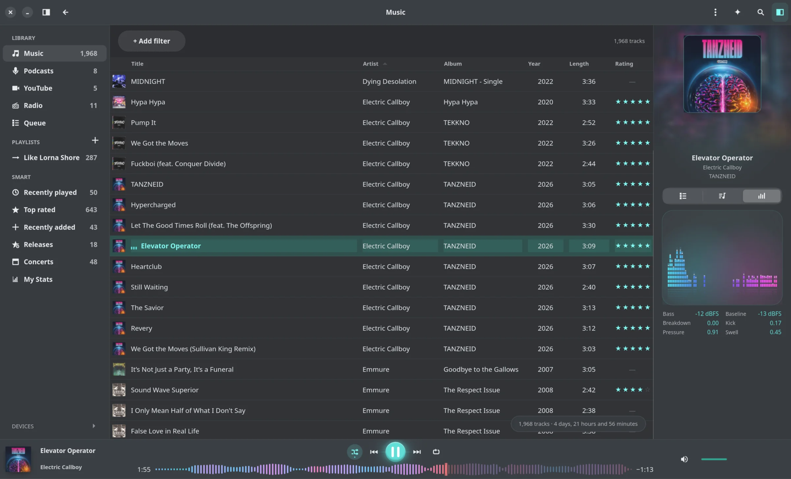

# Reprise

A native music player for GNOME and Android, powered by a shared Rust engine.
Browse your own music, build a queue, follow the lyrics, and take your library
with you — with audio-reactive visuals that make listening feel alive.

<p align="center">
  
  
</p>

**[Explore the interactive showcase](https://marvinbaudach.github.io/reprise/)**
— animated desktop and mobile scenes, a short product film, and the engineering
behind them.

## Downloads

- [GNOME desktop](https://github.com/marvinbaudach/reprise/releases/latest) — Flatpak bundle
- [Android](https://github.com/marvinbaudach/reprise/releases/latest) — universal APK

```sh
flatpak install --user flathub org.gnome.Platform//50
flatpak install --user ./Reprise-<desktop-version>.flatpak
adb install -r ./Reprise-Android-<android-version>.apk
```

The desktop and Android version numbers are independent and are stated on the
release page.

## Why Reprise

- **Your music, organized:** sortable library, search, playlists, metadata
  editing, and listening history, backed by a local database.
- **More in every listen:** lyrics, artwork, audio-reactive visualizers,
  podcasts, and radio; online features are opt-in.
- **At home and on the move:** native GTK4/libadwaita on GNOME, Kotlin/Compose
  on Android, and device synchronization from the desktop.

## Architecture


- `reprise-core` owns library rules, queries, scanning, playlists, settings, and
  platform contracts — never GTK, GStreamer, or D-Bus.
- `reprise-platform-linux` implements GStreamer, MPRIS, MTP, and Trash.
- `reprise-gnome` owns native GTK4/libadwaita presentation and interaction.

Android reaches the shared core through a narrow UniFFI boundary; the CLI and
MCP server expose dedicated headless interfaces.
`scripts/check-architecture.sh` enforces the dependency boundaries.

## Engineering contracts

Every active [UX rule](docs/ux-rules.md) has a rule-named test. Async rows use
generation tokens; network features are opt-in; checks use isolated profiles.
Methods and evidence live in [TESTING.md](TESTING.md) and the
[engineering showcase](docs/showcase.md).

## Contributing

**Pick your entry point:** domain work in `reprise-core`; GTK interaction in
`reprise-gnome`; desktop and device adapters in `reprise-platform-linux`.
Read [CONTRIBUTING.md](CONTRIBUTING.md), then follow [AGENTS.md](AGENTS.md).
Changes start with a failing test and land through a squashed PR into `dev`.

## Build and run

Requires Rust 1.92+, Meson, Ninja, GTK 4.22+, libadwaita 1.9+, SQLite, gettext,
GStreamer Good Plug-ins, and GVfs MTP support.

```sh
cargo build --locked --workspace
cargo run --locked -p reprise-gnome
cargo test --locked --workspace
```

```sh
meson setup _build --prefix="$HOME/.local" -Dprofile=release
meson compile -C _build
meson install -C _build
```

See [flatpak/README.md](flatpak/README.md) for Flatpak packaging. Build the
optional MCP server separately with `cargo build --locked -p reprise-mcp`; add
`--features mpris` to include desktop playback controls.

## Verification

```sh
cargo fmt --check
cargo clippy --locked --all-targets --workspace -- -D warnings
cargo test --locked --workspace
scripts/check-architecture.sh
scripts/check-ux-traceability.sh
```

```sh
MERGE_READINESS_BASE_REF=origin/dev scripts/check-merge-readiness.sh --no-fetch
```

The merge gate also covers Rustdoc, audit, isolated GTK display, accessibility,
and input checks. Release candidates run `scripts/check-release.sh`.

## Documentation

- [CONTRIBUTING.md](CONTRIBUTING.md) — onboarding and pull requests
- [AGENTS.md](AGENTS.md) — workflow and safety boundaries
- [TESTING.md](TESTING.md) — test layers and evidence limits
- [docs/ux-rules.md](docs/ux-rules.md) — interaction contract
- [docs/showcase.md](docs/showcase.md) — deeper engineering evidence
- [RELEASING.md](RELEASING.md) — release checklist

## License

Reprise is **GPL-3.0-or-later**. See [LICENSE](LICENSE) and [LICENSING.md](LICENSING.md).

## How this project is built

Reprise is built with AI assistance. The maintainer directs the product,
reviews changes, and remains responsible for the result. Architecture, UX,
accessibility, and source quality are checked by automated gates;
[TESTING.md](TESTING.md) records what those checks can and cannot prove.
